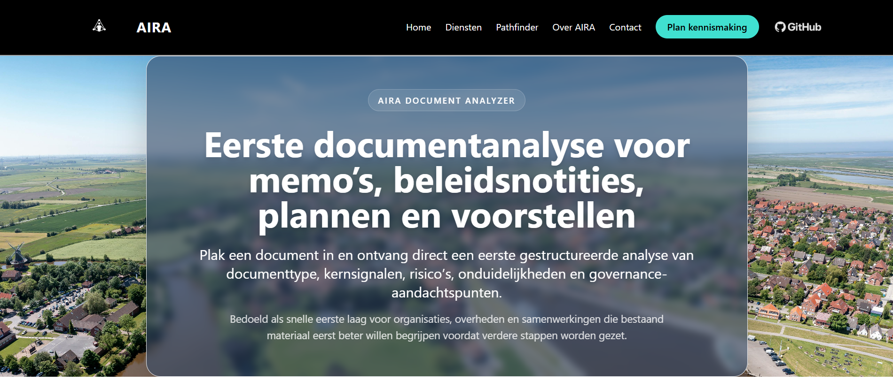
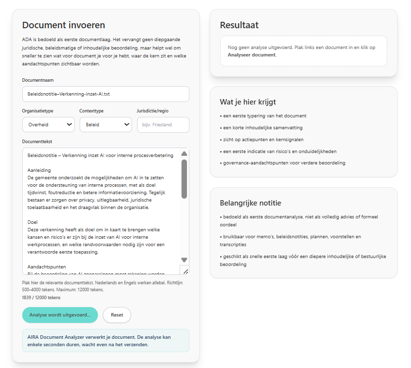
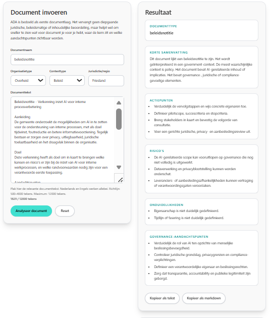

# AIRA Document Analyzer Demo

AI-assisted document analysis workflow for structured review and advisory support.

## Screenshots

### ADA overview

### ADA input

### ADA result

## Overview

AIRA Document Analyzer is designed as a practical first layer for reviewing memo’s, policy notes, plans, proposals, and similar documents.

The showcase demonstrates how a user can submit a document and receive:

- a first document type indication
- a short summary
- detected action points
- risks and ambiguities
- governance-related concerns

## What this repository demonstrates

- document-oriented AI workflow design
- structured first-pass analysis
- practical advisory support logic
- usable interface thinking for real organizational contexts
- rapid MVP-style implementation logic

## Example use cases

- first review of policy notes
- quick interpretation of proposals and plans
- document triage before deeper analysis
- governance-aware review support
- preparation for advisory or decision-support work

## Stack used in the live project

The broader implementation around AIRA Document Analyzer has involved technologies such as:

- Laravel
- Blade / Tailwind CSS
- FastAPI
- Python
- Render
- OpenAI API
- structured prompt / response handling

## Notes

This repository is a public showcase repository. It is intended to demonstrate product direction, implementation style, and interaction design.

It does **not** expose sensitive internal logic, private configuration, secrets, or proprietary orchestration components.

## Website

[AIRA](https://www.aira-ai.com)

## Author

Arjen Wibbens  
Founder, AIRA
